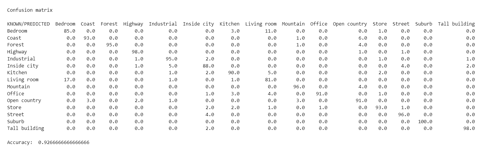

# CNN - Densenet201 - Tranfer Learning

Execute this command to create a compatible environment.

```
conda env create -f environment.yml
```

In this repo, we will train a model to detect the following dataset.
The dataset can be downloaded [here.](https://drive.google.com/file/d/1JqXu1tSejWrwESAU_V5pYBw3PMdK2-yA/view?usp=sharing "Click here")

## Preliminary Analysis

The dataset contains images of different classes such as bedroom, kitchen, inside city. The aim is to train a model to identify the different features and analyze the mistakes that the model does.

The different classes are:

* Bedroom. 116 images.    
* Coast. 260 images.      
* Forest. 228 images.
* Highway. 160 images.
* Industrial. 211 images.
* Inside city. 208 images.
* Kitchen. 110 images.
* Living Room. 189 images.
* Mountain. 274 images.
* Office. 115 images.
* Open Country. 310 images.
* Store. 215 images. 
* Street. 192 images.
* Suburb. 141 images.
* Tall Building. 256 images.

Therefore, it will be necessary to balance the classes. To achive that, class weights have been created using sklearn.

```
from sklearn.utils.class_weight import compute_class_weight as ccw

training_labels = np.array(training_generator.classes)

class_weights = ccw(class_weight='balanced', classes=np.unique(training_labels), y=training_labels)

class_weights_dict = dict(enumerate(class_weights))

```
And then, this class is introduced in tensorflow

```
history = self._model.fit(
                training_generator,
                epochs=epochs,
                steps_per_epoch=len(training_generator),
                validation_data=validation_generator,
                validation_steps=len(validation_generator),
                callbacks=callbacks,
                class_weight=class_weights_dict
            )

```

## Densenet201 final trained model balancing classes (A single Click Solution)

This team has trained a model which we have used to do this analysis. This trained model can be downloaded [here. ](https://drive.google.com/drive/folders/1l2wQRxbgRWG4KLZTtrDErUU6QIUrvj6x?usp=sharing "Click here")

Our team has trained a model with 100 epochs and 2 layers has been unfreezed and this is the results. We added a early-stopping criteria to avoid overfitting and this model only was trained 29 epochs.


Also de matrix confusion has been represented.



It can be observed that the obtained validation set accuracy is 0.9266


## Densenet201 final trained model withoug balancing classes (A Single Click Solution)

This team has trained a model which we have used to do this analysis. This trained model can be downloaded [here. ](https://drive.google.com/drive/folders/1Km1B9xPj4ra8YBGugduULftw7rYzmVIZ?usp=sharing "Click here")

Our team has trained a model with 100 epochs and 2 layers has been unfreezed and this is the results. We added a early-stopping criteria to avoid overfitting and this model only was trained 29 epochs.


Also de matrix confusion has been represented.


It can be observed that the obtained validation set accuracy is 0.917

There is a called in this fuction to predict whether an image is correct or not. This will be the output. In addition, you can see top 3 predictions.


In addition, you can see where the model focus to classify an image. Here an example.


